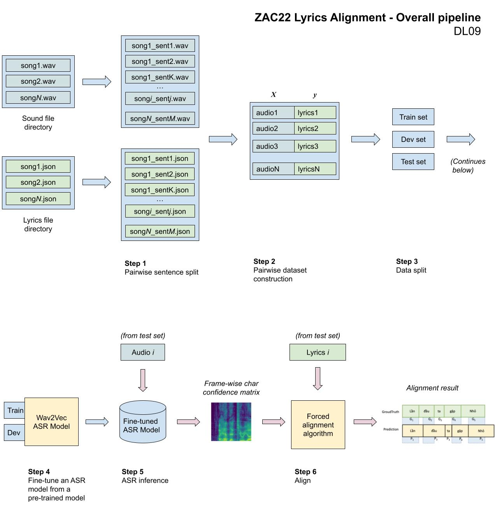
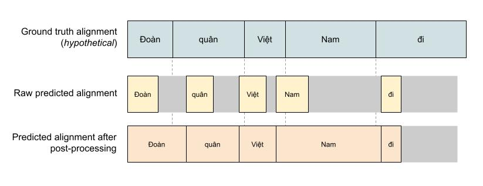

# ZaloAI Challenge 2022 Lyrics Alignment 

## Overview 

The requirement of the challenge Lyrics Alignment (Zalo AI Challenge 2022) is to build a solution to align a song's audio file to its corresponding lyrics (in text format). Concretely, the input and output of this problem are as follows:

- **Input**: the audio file (wav) and lyrics file (text)
- **Output**: token-wise alignment of the lyrics with respect to the audio file (e.g., mark each token beginning and ending time in milliseconds).

Evaluating metrics: Intersection over Union (IoU)

Participating in the competition was part of our final examination for the subject "Deep learning for data science" taught by Dr. Nguyen Tien Huy.

## Our approach 

Our approach consists of two main parts:
- A Vietnamese ASR model fine-tuned from [nguyenvulebinh/wav2vec2-base-vietnamese-250h](https://huggingface.co/nguyenvulebinh/wav2vec2-base-vietnamese-250h).
- [Forced alignment algorithm](https://pytorch.org/audio/main/tutorials/forced_alignment_tutorial.html) (dynamic programming)

Training details (such as hyperparameters) can be found in the `train/3-train.ipynb` file.

**Overall pipeline**

1. Audio and lyrics files are split pairwise (e.g., if the song has *L* sentences, there will be *L* new separate audio and lyrics files based on the provided timestamps). The actual audio data was kept as is (e.g., no augmentation or vocal removal was performed).
2. Construct a pairwise dataset.
3. Train-test split
4. Fine-tune an ASR model based on [nguyenvulebinh/wav2vec2-base-vietnamese-250h](https://huggingface.co/nguyenvulebinh/wav2vec2-base-vietnamese-250h)'s. We observe that after fine-tuning, the model performed worse on regular speech (non-music) data, but we hope it will do better on music data.
5. Feed the test audio into the ASR model
6. Feed the confidence matrix (output of the ASR model) and the test lyrics into the forced alignment algorithm to obtain token-wise alignment.

**More details to the inference process**

The output of the ASR model is a frame-wise confidence matrix. Each column represents an audio frame, and each row is the probability that the audio sampled at this frame pronounces the corresponding sound in the alphabet. We would finally use a language model in a typical ASR model to decode the matrix into a meaningful sentence. But since the objective of this problem is to align the text to the audio (the transcript is already available), we just need the matrix without doing any decoding.

The provided lyrics in the test set have been split sentence-wise by default. But to feed them into the forced alignment algorithm, we have to concatenate and normalize the text. After feeding the confidence matrix and the normalized transcript to the forced alignment algorithm, we should get the alignment of every token in the song.

Finally, we re-split the tokens into their corresponding original sentences, recover the original casing, and adjust the alignment time to continuous. 

Continous timing adjustment is one of the key points to get better IoU score. We observed an increase by 8% in IoU on the public test set after applying the adjustment.

## Results 
- Public test set: 0.38285
- Private test set: 0.47556 (Rank #7)

For teacher's reference: _**Disclaimer**: the scores are calculated on the post-competition leaderboard, but the rank is calculated on the official private leaderboard by **hypothetically** inserting our score into the official leaderboard. Due to some bugs in the submission system at the time, we did not manage to submit the solution on the final day of the competition. We guarantee that the solution submitted in the post-competition leaderboard is computed before the actual competition deadline (30/11/2022)._

## Reproducing 
1. Install conda environment 
2. Set the correct paths in the `.env` file 
3. Run all cells in `predict.ipynb`